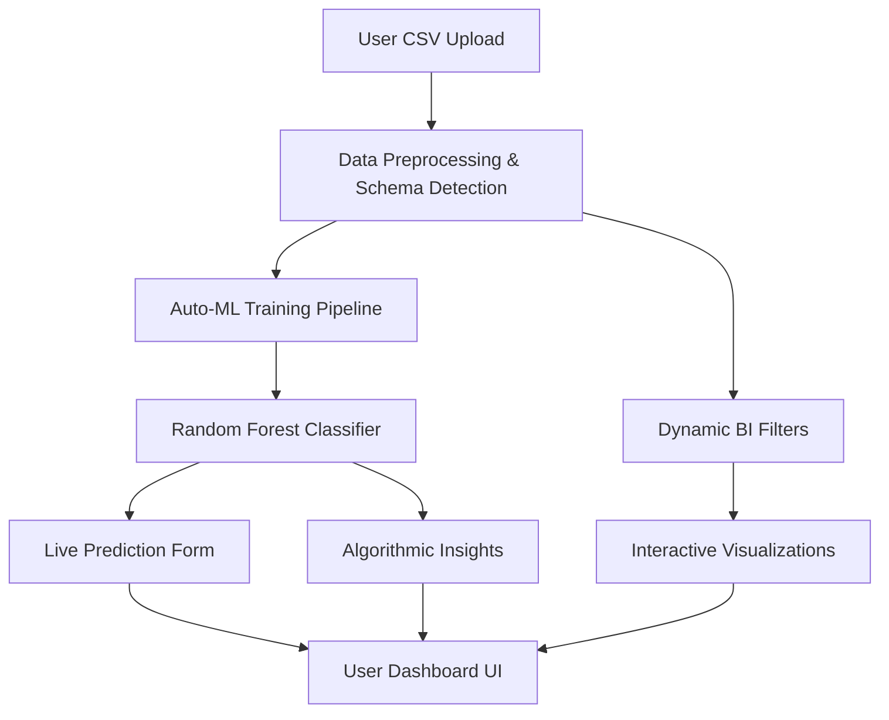

<div align="center">
  
  
  # 🌐 AttritionIQ
  ### *Advanced HR Analytics & Dynamic Machine Learning Engine*
  
  [](https://attritioniq.streamlit.app/)
  [](https://www.python.org/)
  [](https://opensource.org/licenses/MIT)
  [](https://scikit-learn.org/)

  **Empowering HR departments with data-driven predictive insights and automated AI modeling.**
</div>

---

## 📖 About AttritionIQ

**AttritionIQ** is a professional-grade, end-to-end HR analytics platform designed to solve the critical business problem of employee turnover. Unlike static dashboards, AttritionIQ features a **proprietary Auto-ML engine** that allows organizations to upload *any* custom HR dataset and instantly train a specialized predictive model tailored to their unique workforce.

With a premium **Glassmorphism UI** and interactive data exploration tools, AttritionIQ bridges the gap between raw data and actionable retention strategies.

---

## 🚀 Live Demo
### [Explore the Dashboard Live →](https://attritioniq.streamlit.app/)

---

## 📸 Dashboard Preview


---

## 🛠️ Technology Stack

| Layer | Technologies |
| :--- | :--- |
| **Language** | Python 3.12+ |
| **Frontend** | Streamlit, Streamlit Option-Menu, HTML5, Custom Glassmorphism CSS |
| **Machine Learning** | Scikit-Learn (Random Forest, Logistic Regression), XGBoost, Imbalanced-Learn (SMOTE) |
| **Data Processing** | Pandas, NumPy, Scipy, Pickle (Serialization) |
| **Visualization** | Matplotlib, Seaborn, Streamlit-Native charting |
| **Infrastructure** | Streamlit Community Cloud, GitHub Actions, Git |

---

## 🌟 Core Features

### 1. 📂 Dynamic Dataset Upload
Upload any CSV file. The app intelligently scans your data, identifies schemas, and handles persistence across browser refreshes using local caching and URL state.

### 2. 🤖 Dynamic Auto-ML Engine
Select your target variable (e.g., `left` or `attrition`) and watch the app train a specialized Random Forest model on the fly. It includes automatic:
- Missing value imputation
- Categorical encoding (ignoring high-cardinality noise like IDs)
- Feature scaling
- Performance metric generation (Accuracy, Precision, Recall, F1)

### 3. 📊 Advanced Generic Explorer
Interactive data visualization that adapts to your dataset. Generate scatter plots, bar charts, and distribution views by selecting custom axes dynamically.

### 4. 🔮 Live Prediction Suite
A dynamically generated input form that builds itself based on your dataset’s columns, allowing real-time "What-If" analysis for specific employee profiles.

### 5. 💡 Algorithmic Insights
Automatically calculates feature importance and correlations against your target variable to highlight the hidden drivers of employee turnover.

---

## 🏗️ System Architecture



---

## 📂 Repository Structure

```text
AttritionIQ/
│
├── assets/             # Branding and minimalist logos
├── data/               # IBM Sample & Dynamic custom uploads
├── models/             # Pre-trained IBM model serialization
├── screenshots/        # Portfolio UI visual assets
├── app.py              # Main dashboard logic & Auto-ML engine
├── train_model.py      # Core ML pipeline for IBM sample
├── requirements.txt    # Production dependencies
└── README.md           # Professional Documentation
```

---

## ⚙️ Installation & Setup

1. **Clone the project**
   ```bash
   git clone https://github.com/digantamaity/AttritionIQ.git
   cd AttritionIQ
   ```

2. **Install requirements**
   ```bash
   pip install -r requirements.txt
   ```

3. **Run the application**
   ```bash
   streamlit run app.py
   ```

---

## 🤝 Contribution
Contributions are welcome! If you find a bug or have a feature request, please open an issue or submit a pull request.

## 📄 License
This project is licensed under the MIT License - see the [LICENSE](LICENSE) file for details.

---
<div align="center">
  Developed with ❤️ by <a href="https://github.com/digantamaity">Diganta Maity</a>
</div>
